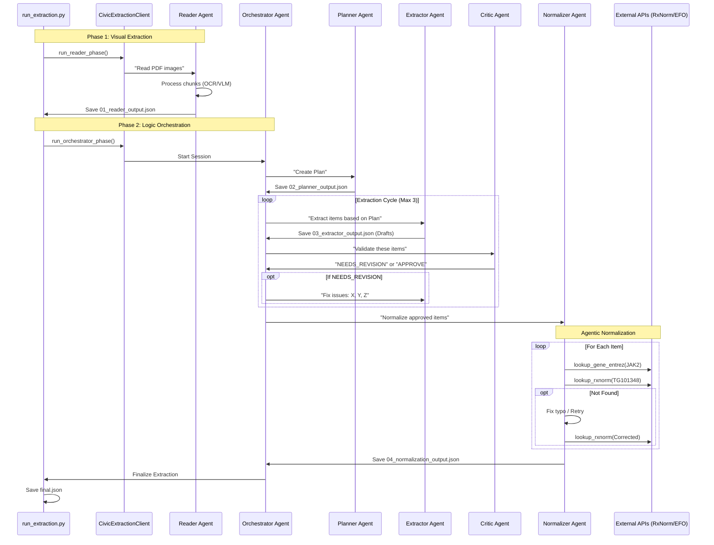

# System Architecture: CIViC Extraction Agent

> **Status:** Production Ready (Verified on 2025-12-10)
> **Architecture:** "Reader-First" Multi-Agent System
> **Framework:** Claude Agent SDK

---

## 1. Project Overview (For Interns)

**What is this?**
This is an AI system that reads scientific papers (PDFs) and extracts structured clinical evidence for the [CIViC](https://civicdb.org) database (Clinical Interpretations of Variants in Cancer).

**The Problem:**
Extracting data from papers is hard because:
1.  Papers are visual (PDFs) with tables and figures.
2.  Clinical logic is complex (genes, variants, drugs, diseases).
3.  We need strict accuracy (no hallucinations).

**The Solution:**
We split the brain into specialized "Agents":
*   **The Reader:** Like a scanner. It reads the PDF once and converts it to clean text/JSON.
*   **The Orchestrator:** The boss. It manages the team.
*   **The Planner:** The strategist. "This is a breast cancer paper about BRCA1."
*   **The Extractor:** The worker. "I found a sentence on page 3 saying BRCA1 V1833F is sensitive to Olaparib."
*   **The Critic:** The reviewer. "Wait, page 3 actually says *resistant*. Fix it."
*   **The Normalizer:** The librarian. "Standardizing 'Olaparib' to RxNorm ID 12345."

**Key Concept: "Reader-First"**
Instead of letting every agent read the PDF (expensive & slow), the **Reader** runs *once*. Everyone else works from the text it extracts. This is the "Single Source of Truth."

---

## 2. High-Level Design (HLD)

### System Flow

```mermaid
graph TD
    User[User / PDF] -->|Input| Reader[Reader Agent]
    
    subgraph Phase 1: Visual Processing
    Reader -->|PDF -> Images| VLM[Vision Model]
    VLM -->|Extracts| Content[Structured Paper Content]
    Content -->|Save Checkpoint| Disk1[01_reader_output.json]
    end
    
    subgraph Phase 2: Orchestration (Text Only)
    Content -->|Context| Orchestrator[Orchestrator Agent]
    Orchestrator -->|Delegates| Planner[Planner]
    Orchestrator -->|Delegates| Extractor[Extractor]
    Orchestrator -->|Delegates| Critic[Critic]
    Orchestrator -->|Delegates| Normalizer[Normalizer]
    end
    
    subgraph Phase 3: Output
    Normalizer -->|Enrich| Evidence[Final Evidence Items]
    Evidence -->|Save| DiskFinal[extraction.json]
    end
```

### Core Components

| Component | Responsibility | Key File |
| :--- | :--- | :--- |
| **`Reader`** | Image-to-Text conversion. Handles tables/figures. | `civic_extraction/agents/reader.py` |
| **`Orchestrator`** | Managing the lifecycle and state. | `civic_extraction/agents/orchestrator.py` |
| **`CIViCContext`** | Global state (extracted text, draft items). | `civic_extraction/context/state.py` |
| **`Tools`** | Functions agents can call (save, lookup). | `civic_extraction/tools/` |

---

## 3. Low-Level Design (LLD) & Sequence Diagram

This diagram shows exactly what happens when you run `python run_extraction.py`.



---

## 4. Agent & Tool Map (For SDEs)

This table maps exactly which Python file defines the agent and which tools it has access to.

| Agent | Source File | System Prompt | Tools Access |
| :--- | :--- | :--- | :--- |
| **Reader** | `agents/reader.py` | "Your ONLY job is to read... extract ALL content..." | `save_paper_content` |
| **Planner** | `agents/planner.py` | "Identify key variants... estimate items..." | `get_paper_content`, `save_extraction_plan` |
| **Extractor** | `agents/extractor.py` | "Extract evidence items... 8 required fields..." | `get_paper_content`, `get_extraction_plan`, `save_evidence_items` |
| **Critic** | `agents/critic.py` | "Validate verbatim quotes... check logic..." | `get_paper_content`, `get_draft_extractions`, `save_critique`, `increment_iteration` |
| **Normalizer** | `agents/normalizer.py` | "Standardize entities... Intelligent Error Handling..." | `get_draft_extractions`, `save_evidence_items`, `finalize_extraction`<br>**Lookups:** `lookup_rxnorm`, `lookup_efo`, `lookup_gene_entrez`, `lookup_safety_profile`, etc. |

---

## 5. File Guide: Where to Look

### "I want to change how we parse the PDF."
*   **File:** `civic_extraction/client.py` -> `_load_images_from_pdf` method.
*   **File:** `civic_extraction/agents/reader.py` -> Prompt definition.

### "The extraction is missing the 'Drug' field."
*   **File:** `civic_extraction/agents/extractor.py` -> `EXTRACTOR_SYSTEM_PROMPT`.
*   **File:** `civic_extraction/schemas/evidence_item.py` -> Pydantic model.

### "Normalization is failing for a specific drug."
*   **File:** `civic_extraction/tools/normalization_tools.py` -> Check `_lookup_rxnorm_internal`.
*   **File:** `civic_extraction/agents/normalizer.py` -> Check prompt for retry logic.

### "I want to add a new step to the pipeline."
*   **File:** `civic_extraction/client.py` -> Add agent definition.
*   **File:** `civic_extraction/agents/orchestrator.py` -> Update `ORCHESTRATOR_SYSTEM_PROMPT` instructions.

---

## 6. Technical Deep Dive (SDEs)

### State Management
We use a centralized **Context Object** (`civic_extraction/context/state.py`).
*   It is NOT just a dict; it uses `dataclasses` for type safety.
*   `ctx.state.paper_content`: The large text blob from Reader.
*   `ctx.state.extraction_plan`: The strategy.
*   `ctx.state.draft_extractions`: List of dictionaries.

### Checkpointing (Resumability)
The system is crash-resistant. `run_extraction.py` checks for JSON files on disk before running an agent.
*   **Level 1:** `01_reader_output.json` (Heavy compute).
*   **Level 2:** `02_planner_output.json`.
*   **Level 3:** `03_extractor_output.json` (Drafts).
*   **Level 4:** `04_normalization_output.json`.

### Async & Normalization
*   Normalization tools (`tools/normalization_tools.py`) use `aiohttp` for concurrent API calls.
*   The `Normalizer` agent is **Agentic**: It doesn't just run a batch script. It "thinks" ("RxNorm failed, let me try searching for the synonym").

### Pydantic & Validation
*   We use strict Pydantic models in `schemas/` to validate tools inputs/outputs.
*   Be careful when moving data between Pydantic models and raw Dicts (we handled this in `extraction_tools.py` by converting inputs).

