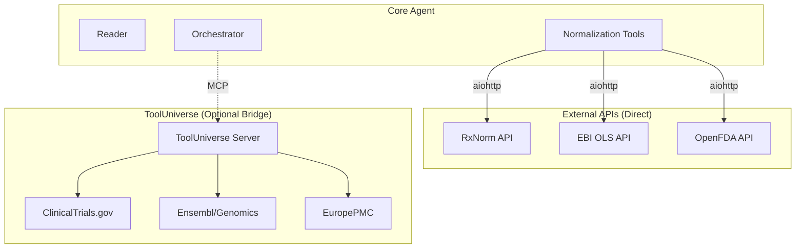

# ToolUniverse Integration Plan: "Beyond CIViC"

## 1. Executive Summary
This document outlines the strategy for integrating **ToolUniverse** (768+ scientific tools) into the CIViC Extraction Agent. 

**Goal:** Transform the system from a single-purpose extraction tool into a **General-Purpose Clinical Curation Assistant**.

**Status:**
*   ✅ **Sandbox Verified:** RxNorm, EFO, FAERS (MedDRA) tools have been tested and return valid data.
*   ✅ **Environment Ready:** A dedicated `uv` environment (`tooluniverse-env`) is set up.
*   🚧 **Integration Pending:** Core codebase needs to be updated to use these tools.

---

## 2. Capability Analysis

### A. High-Priority: "Replacement-Grade" Clinical Curation
These tools are essential for meeting the "Replacement-Grade" criteria (Provenance, Standardization, Safety).

| Category | ToolUniverse Tool | Function | Application in CIViC Agent |
| :--- | :--- | :--- | :--- |
| **Drugs** | `RxNormTool` | `RxNorm_get_drug_names` | Normalizing "Gleevec" → `RXCUI:282386` (Imatinib). Essential for synonym handling. |
| **Diseases** | `EFOTool` | `OSL_get_efo_id_by_disease_name` | Mapping "Melanoma" → `EFO:0000756`. Provides ontology IDs for graph databases. |
| **Safety** | `FDADrugAdverseEventTool` | `FAERS_count_reactions_by_drug_event` | Validating safety claims against FDA data (e.g., "Drug X causes Nausea"). |
| **Trials** | `ClinicalTrialsSearchTool` | `search_clinical_trials` | Finding related trials for extracted evidence. |

### B. Strategic Expansion: "Beyond CIViC" Modules
These tools enable entirely new workflows (Genomics, Literature Search).

| Category | ToolUniverse Tool | Function | New Workflow Enabled |
| :--- | :--- | :--- | :--- |
| **Genomics** | `EnsemblLookupGene` | `ensembl_lookup_gene` | **Variant Annotation:** Enriching extracted variants with genomic coordinates (chr, start, end). |
| **Genomics** | `gnomADGetGeneConstraints` | `gnomad_get_gene_constraints` | **Population Frequency:** Filtering out common benign variants. |
| **Literature** | `EuropePMC_search_articles` | `EuropePMC_search_articles` | **Automated Meta-Analysis:** Finding *other* papers that discuss the extracted variant. |
| **Guidelines** | `NICEWebScrapingTool` | `NICE_Clinical_Guidelines_Search` | **Guideline Check:** verifying if extracted evidence matches current NICE guidelines. |

---

## 3. Integration Strategy

We will use a **Hybrid Integration Approach**:

1.  **Direct API Integration (Lightweight):**
    *   For high-frequency, critical tools (RxNorm, EFO, FAERS), we will implement lightweight Python wrappers *directly* in `civic_extraction/tools/normalization_tools.py`.
    *   **Why:** Avoids the heavy dependency of the full ToolUniverse package for core production features. Keeps the agent fast and deployable.
    *   **Implementation:** `aiohttp` calls to NLM/EBI/FDA APIs (already prototyped in `sandbox_ontologies.py`).

2.  **ToolUniverse MCP Bridge (Heavyweight):**
    *   For advanced/expansion features (Genomics, Guidelines), we will connect to the external `tooluniverse-smcp-stdio` server.
    *   **Why:** These tools are complex to re-implement. ToolUniverse handles the complexity perfectly.
    *   **Implementation:** Add `tooluniverse` as a secondary MCP server in `client.py`.

---

## 4. Implementation Roadmap

### Phase 1: Core Normalization (Immediate)
*   **Action:** Port the successful `sandbox_ontologies.py` logic into `civic_extraction/tools/normalization_tools.py`.
*   **Outcome:** The `normalize_extractions` tool will automatically tag items with RxNorm and EFO IDs.

### Phase 2: Safety & Validation Module
*   **Action:** Add `validate_safety_claims` tool using FAERS data.
*   **Outcome:** The Critic agent can say: *"The paper claims 'minimal toxicity', but FDA data shows 15% Grade 3 events. Flagging for review."*

### Phase 3: The "Synthesizer" Agent
*   **Action:** Create a new Agent that uses `EuropePMC_search_articles`.
*   **Outcome:** After extracting from Paper A, the Synthesizer searches for Paper B and C to check for consensus.

---

## 5. Technical Architecture

